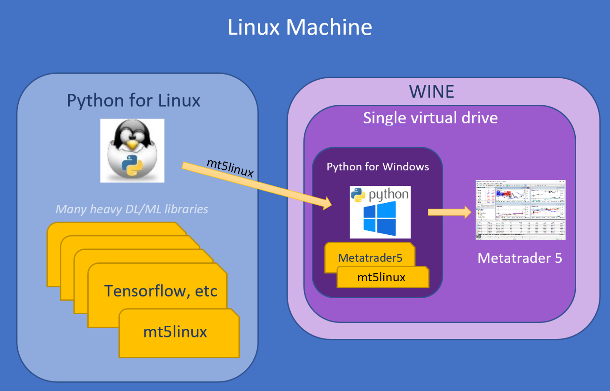

# Motivation and Use Cases

*This section explains the purpose of mt5linux and the motivation behind it, courtesy of [ananta-dev](https://github.com/ananta-dev).*

---

Hi,
First of all, thank you Lucas for sharing this excellent work with us all.

Following Lucas' suggestion, I will point out that the description of the purpose of mt5linux and the motivation behind it in the README is rather brief, and for newcomers, like me, with limited experience in running MT5 on Linux, it can be somewhat confusing in its brevity.

I will also try and clarify some of the potential doubts.

1. Do you really need mt5linux?
It depends on your goal. If all you want to do is to run Python and Metatrader 5 on a Linux machine so that your Python-based algorithmic trading system can execute trades via Metatrader 5, then you probably do not need mt5linux. To achieve that goal, all you really need to do is to install both Python for Windows and Metatrader 5 on the same virtual drive in Wine, and install the Metatrader5 library on the Python for Windows. That's it.

2. OK, then, who needs mt5linux?
Let us suppose that you are a machine learning wizard and you use Python for Linux running natively on a Linux machine, where you have installed a zillion heavy libraries, such as Tensorflow in your venv or Anaconda virtual environment. If you now want this pre-existing and very rich Python for Linux to be able to interact with Metatrader 5 installed on the same Linux machine, this is not so easy to accomplish. The Metatrader5 library cannot be used in Python for Linux. It can only be used by Python for Windows.

So, what can you do?

You could install a second instance of Python on the machine. This one a Python for Windows running on Wine. You could then install MT5 on the same Wine virtual drive, and the Metatrader5 library on the Python for Windows. This Python for Windows can then control MT5.

Now, how do you communicate the Python for Linux instance running natively on the Linux machine with the Python for Windows instance running on Wine and controlling MT5?

mt5linux to the rescue!

mt5linux can act as the bridge between these two Python installations, as illustrated by the following diagram:

